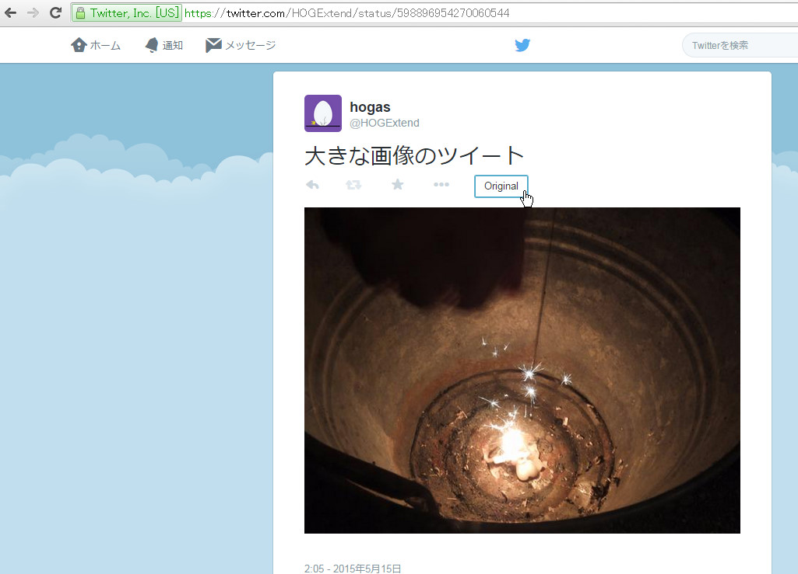
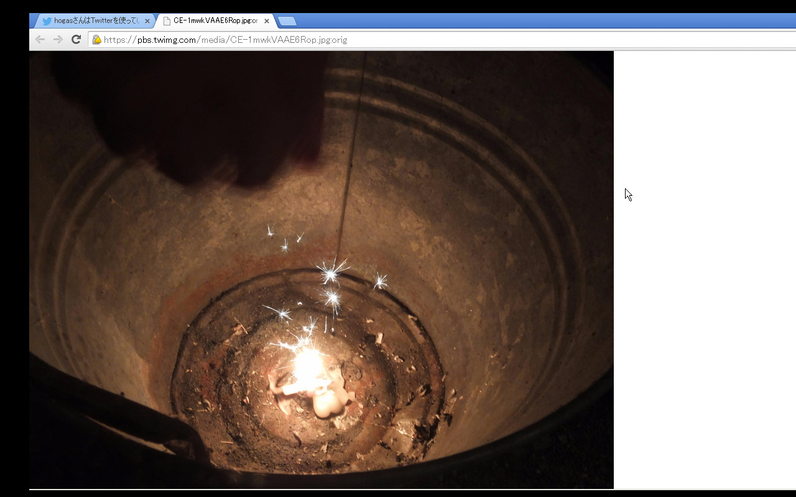

# twitterOpenOriginalImage
Open original image to new tab. It's an extension of GoogleChrome.

This is available in here: 
  https://chrome.google.com/webstore/detail/kmcomcgcopagkhcbmcmcfhpcmdolfijg 

Usage: 
  1. Open an image tweet (like this: "https://twitter.com/HOGExtend/status/598896954270060544"). 
  2. Push the button "Original" or push the key [Enter(Return)]. 

  3. It opens original image in new tab. 

  ! "Original image" means like this; "https://pbs.twimg.com/media/CE-1mwkVAAE6Rop.jpg:orig" 
  ! It's the url "https://pbs.twimg.com/media/CE-1mwkVAAE6Rop.jpg" and adding ":orig" 

Contact: 
  twitter: @HOGExend 
