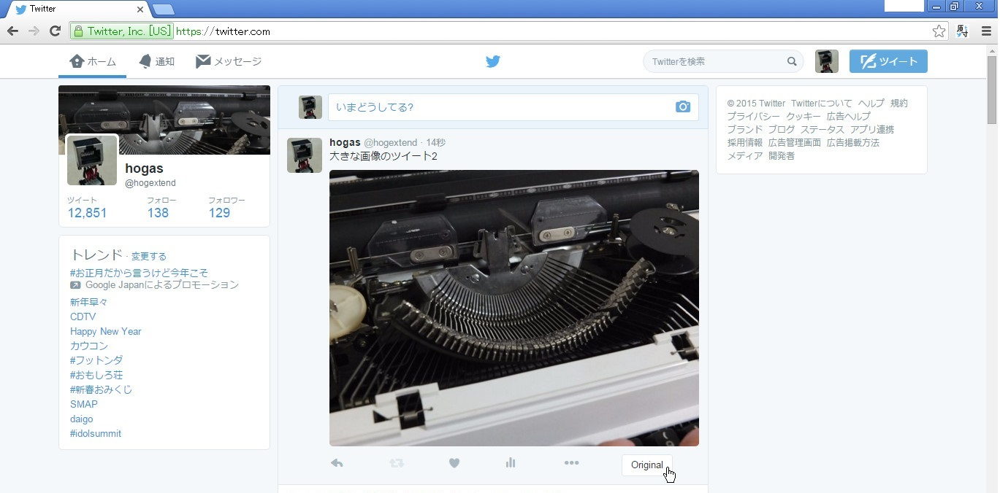
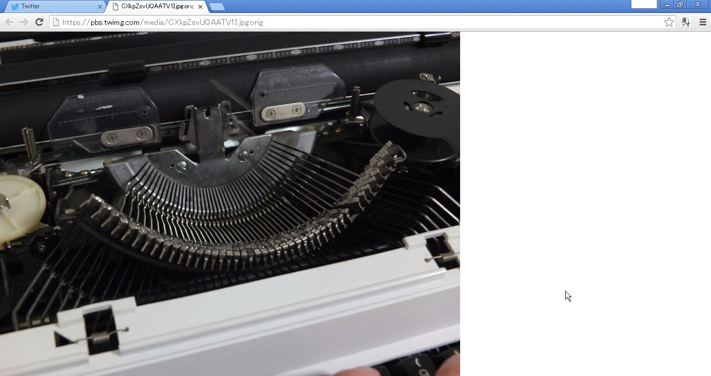
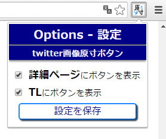

# twitter画像原寸ボタン

画像ツイートの画像の原寸を新しいタブで開く、GoogleChrome拡張機能です。  
TwitterWeb公式、TweetDeckで動作します。

## インストール

Chromeウェブストアからインストール: [twitter画像原寸ボタン](https://chrome.google.com/webstore/detail/kmcomcgcopagkhcbmcmcfhpcmdolfijg)

## 使い方

画像ツイートに付いた"Original"ボタンをクリックすると、原寸画像が新しいタブに開かれます。  
  

- "原寸画像"とは、次のような画像を指します: "https://pbs.twimg.com/media/CE-1mwkVAAE6Rop.jpg:orig"
  - これは通常の(縮小された)画像のURL ("https://pbs.twimg.com/media/CE-1mwkVAAE6Rop.jpg") に ":orig" を足したものです
  - 縮小の閾値は随時変更されているようなので、":orig"を付けたものが必ず原寸とは限りません

ツイート詳細では、Enterキーを押すと"Original"ボタンをクリックしたのと同じように、原寸画像が新しいタブに開かれます。

### 設定

1. Chromeのウィンドウ右上にある拡張機能のボタンをクリックする(またはChromeの拡張機能の設定からこの拡張機能の"オプション"をクリックする)
1. 使いたい機能にチェックを入れ、"設定を保存"をクリックする

## 注意

求める権限に「閲覧履歴の読み取り」がありますが、閲覧履歴を読み取ることはしていません。  
タブ間の設定共有のために、タブ操作の権限を使っているため、それが「閲覧履歴の読み取り」と表示されています。

- 公式ドキュメント: chrome.tabs - Google Chrome

## 連絡先

- Twitter: [@hogextend](https://twitter.com/hogextend)
- Email: hogextend@gmail.com
