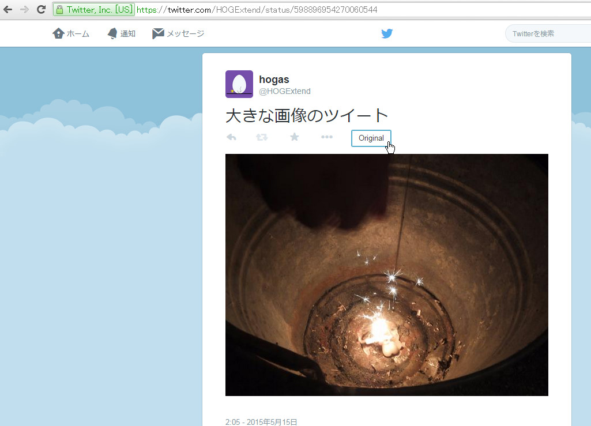
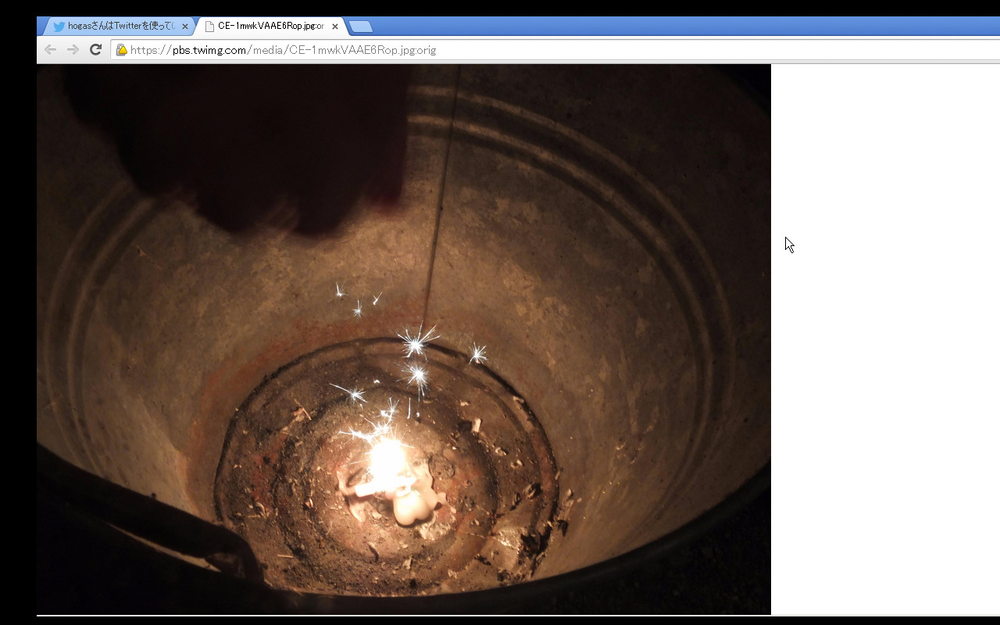

# twitterOpenOriginalImage

Opens tweeted image(s) in original size to new tab(s). This is an extension of GoogleChrome.

##Installation

Available in Chrome Web Store: 
  https://chrome.google.com/webstore/detail/kmcomcgcopagkhcbmcmcfhpcmdolfijg 

##Usage

###Tweet detail page

  1. Open an image tweet (like this: "https://twitter.com/hogextend/status/598896954270060544"). 
  2. Click the button "Original" or press the [Enter(Return)] key. 
 
  3. It opens original image in new tab. 
 

###Timeline

  1. Click the button "Original" (on image tweet). 
 

  2. It opens original image in new tab. 
 

  ! "Original image" means like this; "https://pbs.twimg.com/media/CE-1mwkVAAE6Rop.jpg:orig" 
  ! It's the resized image's url "https://pbs.twimg.com/media/CE-1mwkVAAE6Rop.jpg" plus ":orig" 

###Option

  1. Press the extension button in top right of chrome. 
 
  2. Modify which function you use and press the botton "設定を保存" (Save the Settings).

If you want to edit this project, please contact me as you possible. 

##Contact:

  twitter: [@hogexend](https://twitter.com/hogextend)

---

## Changes
ver.2.0.6 [2016/04/23] Set Original-button on Tweetdeck (timeline only) and improved saving behavior. 
ver.2.0.5 [2016/03/19] Fixed "don't open images with return-key when replying", "show Original-button on tweet-image-gallery", "don't get rid of Original-button on timeline". 
ver.2.0.4 [2016/02/06] Fixed that tweet opens in popup when you press the Original-button. 
ver.2.0.3 [2016/01/22] Add "Open with Return Key" option. 
ver.2.0.2 [2016/01/13] Fixed URL to open (":bla" to ":orig"). 
ver.2.0.1 [2016/01/13] Fixed URL to open (it had had ":orig:orig" in its tail). 
ver.2.0 [2016/01/01] Changed the Original-button appearance (appears in timeline, too) and add option to choose which function to use. 
ver.1.6.2 [2015/12/09] Fixed Original-button appearance (not to appear the button on a non-photo-tweet) 
ver.1.6.1 [2015/12/09] Coped with the change of photo-tweet showing in twitter (again) 
ver.1.6 [2015/10/28] Coped with the change of photo-tweet showing in twitter 
ver.1.5.2 [2015/10/20] Fixed Original-button position (to the side of action-buttons).  
ver.1.5.1 [2015/08/02] Fixed the behavior of multiple-photo-tweet-reply to multiple-photo-tweet situation.  It did open former photos (and so on).  
ver.1.5 [2015/07/20] Coped with the change of multiple-photo-tweet showing in twitter 
ver.1.3 [2015/05/14] Coped with reply-photo-tweet to photo-tweet 
　[2015/03/24] Fixed readme.txt 
ver.1.2 [2015/03/19] Coped with multiple-photo-tweet, fixed behavior 
ver.1.1 [2015/02/16] Added operation procedure ([Enter(Return)] key), fixed behavior 
ver.1.0 [2015/02/15] Released 
